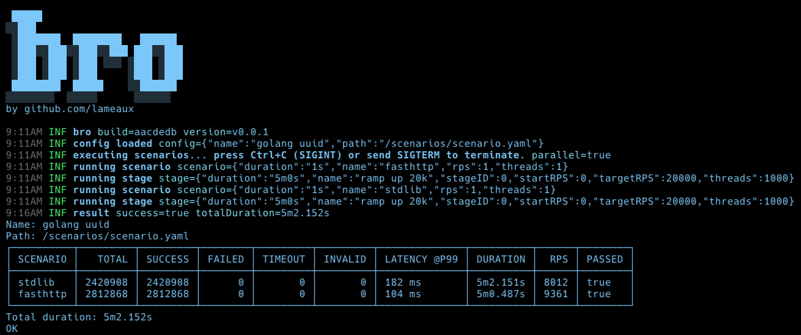
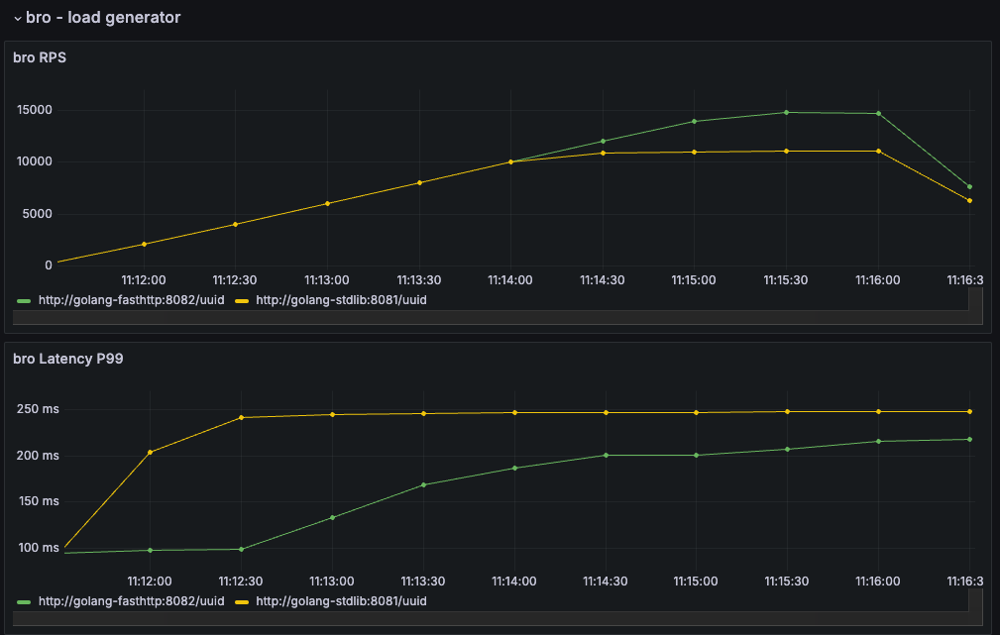

# bro

**bro** is a load testing tool.



**bro** enables you to run load testing scenarios with both constant and variable rate traffic patterns.

During the execution, it collects metrics such as **RPS** (requests per second), **latency**, and **errors**, and validates them against defined thresholds. 

## Installation

The tool is written in [Go](https://github.com/golang/go).
You can build the binary from the source code and run it on your local machine or run it as a Docker container.

### Building from source codes

Make sure you have [Go](https://go.dev/doc/install) installed and `GOPATH` is set up correctly.

Clone this repository and run `make install`:

```shell
git clone https://github.com/lameaux/bro.git
cd bro
make install
```

You will have `bro` binary installed in `$GOPATH/bin`, make sure it is present in your `PATH`. 

```shell
bro -r 10 -t 2 -d 5s -u https://httpbin.org
```


### Running in a Docker container

```shell
docker run --rm ghcr.io/lameaux/bro -r 10 -t 2 -d 5s -u https://httpbin.org
```

## Usage

To run the app, you need to define a testing scenario — either by providing a **YAML file** or by specifying it directly through **program arguments** (flags).

See [User Manual](docs/user-manual.md) for more details on how to use the app.

### YAML file
To run the test you need to provide a path to a YAML file with scenario configuration.

```shell
bro [flags] path/to/config.yaml
```

To run one of the examples:

```shell
bro -silent examples/ping/httpbin.yaml
Name: Ping httpbin
Path: examples/ping/httpbin.yaml
┌──────────────┬───────┬─────────┬────────┬─────────┬─────────┬──────────────┬──────────┬─────┬────────┐
│ SCENARIO     │ TOTAL │ SUCCESS │ FAILED │ TIMEOUT │ INVALID │ LATENCY @P99 │ DURATION │ RPS │ PASSED │
├──────────────┼───────┼─────────┼────────┼─────────┼─────────┼──────────────┼──────────┼─────┼────────┤
│ Check 200 OK │    50 │      50 │      0 │       0 │       0 │ 1083 ms      │   5.194s │  10 │ true   │
└──────────────┴───────┴─────────┴────────┴─────────┴─────────┴──────────────┴──────────┴─────┴────────┘
Total duration: 5.194s
OK
```

See [User Manual](docs/user-manual.md) and [Examples](./examples/README.md) for more details on how to write scenarios.

### Program arguments

You can run a test by providing scenario configuration using program arguments:

```shell
bro [flags] -r <rps> -t <threads> -d <duration> -u <url>
```

For example:

```shell
bro -silent -r 10 -t 2 -d 5s -u https://httpbin.org
Name: Calling https://httpbin.org
┌──────────┬───────┬─────────┬────────┬─────────┬─────────┬──────────────┬──────────┬─────┬────────┐
│ SCENARIO │ TOTAL │ SUCCESS │ FAILED │ TIMEOUT │ INVALID │ LATENCY @P99 │ DURATION │ RPS │ PASSED │
├──────────┼───────┼─────────┼────────┼─────────┼─────────┼──────────────┼──────────┼─────┼────────┤
│ flags    │    50 │      50 │      0 │       0 │       0 │ 914 ms       │   5.104s │  10 │ true   │
└──────────┴───────┴─────────┴────────┴─────────┴─────────┴──────────────┴──────────┴─────┴────────┘
Total duration: 5.104s
OK
```

See [User Manual](docs/user-manual.md) for more details on how to write scenarios.

### Flags

There is a list of flags that you can use with bro:

```
Usage of bro:
  -brodAddr string
        address (host:port) of brod, e.g. brod:8080
  -d duration
        alias for duration
  -debug
        set log level to DEBUG
  -duration duration
        scenario duration, e.g. 5s
  -f string
        alias for format (default "txt")
  -format string
        format: txt or csv (default "txt")
  -group string
        test group identifier
  -logJson
        set log output format as JSON
  -m string
        alias for method
  -method string
        http method, e.g. POST
  -o string
        alias for output (default "stdout")
  -output string
        output: stdout, path/to/file (default "stdout")
  -r int
        alias for rps
  -rps int
        target RPS for scenario
  -silent
        set log level to ERROR
  -skipBanner
        do not show banner on start up
  -skipExitCode
        do not set exit code on test failure
  -t int
        alias for threads
  -threads int
        number of concurrent threads for scenario
  -timeout duration
        http request timeout duration, e.g. 5s
  -u    alias for url
  -url
        target URL for scenario
```

See [User Manual](docs/user-manual.md) for more details.

## What's next?

- Try **bro** together with **[mox](https://github.com/lameaux/mox)**, a tool for stubbing external dependencies, to test your application in isolation.
- Check out [NFT repo](https://github.com/lameaux/nft) to see advanced scenarios for non-functional testing using **bro** & **mox** .




